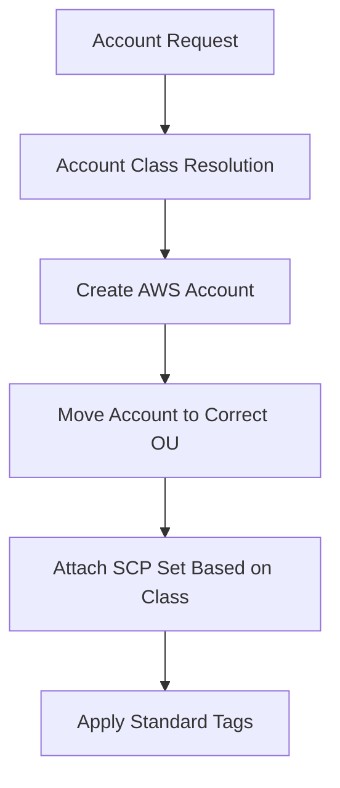

# AWS Landing Zone (Terraform)

This repo is a **foundation landing zone** starter built as **small, composable Terraform stacks**.  
Each numbered folder is meant to be planned/applied independently, in a predictable order.


---

## What this repo does (high level)

- **Org guardrails**: starter SCPs attached to OUs (region allowlist, protect logging, encryption enforcement, IAM hardening, quarantine).
- **Identity baseline**: permission boundaries + break-glass and audit roles.
- **Security baseline scaffolding**: delegated admin registration for GuardDuty and (optionally) Security Hub.
- **Backup governance**: AWS Organizations **backup policies** per OU (prod/nonprod/sandbox) with tag-based selection.
- **Regional baselines**: minimal per-region baseline placeholders (currently a CloudWatch Log Group per region).
- **Workload onboarding example**: small secure resource example (S3 + IAM role) that represents how teams can onboard safely.
- **Enterprise optional add-ons**: toggled services like Security Lake and Firewall Manager setup.

This is intentionally **lab-friendly** (small blast radius, minimal cost), and designed to grow into a real enterprise repo.

---

## Repository layout

```text
aws-landing-zone/
├── 00-bootstrap/                # Shared naming/tags + provider basics (and backend notes)
├── 01-governance/               # SCP guardrails (Org level)
├── 02-identity/                 # IAM boundaries and access control
├── 03-security-baseline/        # Organization security services (delegated admin scaffolding)
├── 04-backup-policies/          # Backup governance policies (Org backup policies)
├── 05-account-vending           # Create a new AWS account
├── 06-regional/
│   ├── us-east-1/               # Regional baseline (Primary)
│   └── us-east-2/               # Regional baseline (DR)
├── 07-workload-integration/     # Secure workload onboarding example (RAM joins + baseline)
├── 08-platform-services/        # RESERVED (future platform baselines)
├── 09-enterprise-advanced/      # Optional enterprise-grade services (cost-aware toggles)
└── env/
    └── lab.auto.tfvars          # Shared environment configuration (recommended; not in the zip today)
```

> **Reserved folders**
> - **08-platform-services** is reserved for future shared platform baselines (EKS baseline, shared services, etc.).

### Note about `env/`
Your zip **does not currently include** an `env/` folder. The sub-folder READMEs reference it, so the recommended approach is to add it.

Create:

- `env/lab.auto.tfvars` (committable in a lab repo if it contains no secrets)
- optionally `env/lab.auto.tfvars.example` (safe template for real org repos)

Example `env/lab.auto.tfvars` is included further down.

---

## Deployment model (how to run)

Each folder is a small Terraform stack.

### Prereqs
- Terraform **>= 1.6**
- AWS provider **>= 5.50**
- AWS Organization exists (for `01-governance`, `04-backup-policies`, `03-security-baseline`, `09-enterprise-advanced`)
- Credentials that can administer the target scope:
  - **Management account** for org-level resources
  - **Security admin / shared services account** depending on your org model
  - **Workload accounts** for `07-workload-integration` examples

### Recommended apply order
1. `00-bootstrap` (read-only helpers + sanity)
2. `01-governance` (SCPs)
3. `02-identity` (boundaries + roles)
4. `03-security-baseline` (delegated admin registrations)
5. `04-backup-policies` (org backup policies)
6. `05-account-vending` (Create a new AWS account)
7. `06-regional/us-east-1` and `06-regional/us-east-2`
8. `07-workload-integration` (example onboarding in a workload account)
9. `09-enterprise-advanced` (optional, turn on one feature at a time)

---

## Quickstart (lab)

From repo root:

```bash
# one-time per stack
terraform -chdir=01-governance init

# plan/apply using shared vars
terraform -chdir=01-governance plan  -var-file=../env/lab.auto.tfvars
terraform -chdir=01-governance apply -var-file=../env/lab.auto.tfvars
```

Repeat per folder.

### About AWS profiles
One folder currently hardcodes a profile:

- `01-governance/providers.tf` uses `profile = "aws_lab"`.

Everything else relies on standard AWS credential resolution (env vars, SSO, profiles, etc.).

**Best practice**: standardize this repo so *every* stack uses the same approach. Two clean options:

1. Use environment variables:
   - `AWS_PROFILE=aws_lab terraform ...`
2. Or introduce `variable "aws_profile"` and wire `profile = var.aws_profile` consistently.

---

## Stack-by-stack: what each folder creates

### 00-bootstrap
Purpose: shared naming conventions and a standard tagset.

Files:
- `naming.tf` defines `local.common_tags` including `Owner`, `CostCenter`, `ManagedBy=terraform`, `Program`, `Org`.
- `providers.tf` configures primary and DR provider blocks.
- `backend.tf` documents how to switch from local state to S3/DynamoDB.

Key inputs:
- `org` (required), `owner` (required)
- `program` (default: `lz`)
- `primary_region` (default: `us-east-1`), `dr_region` (default: `us-east-2`)

---

### 01-governance (SCP guardrails)
Purpose: create starter SCPs and attach them to OUs / root.

Creates SCPs:
- Region allowlist (primary + DR)
- Protect logging (prevents disabling CloudTrail/Config)
- Enforce encryption (starter example)
- Deny dangerous IAM primitives (starter hardening)
- Quarantine (deny everything; use carefully)

Attaches:
- Region allowlist to the Org root
- Protect logging to prod and nonprod OUs
- Encryption to prod OU
- Dangerous IAM deny to security OU
- Quarantine policy to quarantine OU

Outputs:
- `scp_ids` map

Inputs you must provide:
- OU IDs: `ou_security_id`, `ou_infrastructure_id`, `ou_workloads_prod_id`, `ou_workloads_nonprod_id`, `ou_sandbox_id`, `ou_quarantine_id`

---

### 02-identity (permission boundaries + baseline roles)
Purpose: enforce least-privilege guardrails for human/automation roles.

Creates:
- Permission boundary policies:
  - `*-boundary-workload`
  - `*-boundary-sandbox`
- Baseline roles:
  - `*-breakglass` (AdministratorAccess attached; restrict assume principals!)
  - `*-audit-readonly` (SecurityAudit policy attached)

Outputs:
- `permission_boundary_arns`
- `baseline_roles`

Important:
- `breakglass_principal_arns` controls who can assume break-glass.
  - If empty, it falls back to account root (fine for a lab, not ideal long-term).

---

### 03-security-baseline (delegated admin scaffolding)
Purpose: register org delegated admin accounts for security services.

Creates:
- GuardDuty org delegated admin registration
- Security Hub delegated admin registration (optional toggle)

Outputs:
- `delegated_admin` map

Inputs:
- `security_admin_account_id` (required)
- `enable_security_hub` (default false)

Note:
Enabling detectors/standards in every account is typically done via StackSets/AFT/CT customizations from the delegated admin account.
This stack is only the **org registration** portion.

---

### 04-backup-policies (AWS Organizations Backup Policies)
Purpose: define backup policy baselines per OU (prod/nonprod/sandbox).

Creates (toggle-controlled):
- `BACKUP_POLICY` for prod OU
- `BACKUP_POLICY` for nonprod OU
- `BACKUP_POLICY` for sandbox OU

Outputs:
- `backup_policy_ids`

Inputs:
- OU IDs: `ou_workloads_prod_id`, `ou_workloads_nonprod_id`, `ou_sandbox_id`
- Retention controls: `backup_retention_days_prod`, `backup_retention_days_nonprod`, `backup_retention_days_sandbox`
- `enable_backup_policies` (bool)

---

### 05 – Account Vending (Enterprise Class-Based Model)

## Overview

This module provisions AWS accounts using a **class-based enterprise model**.

Instead of manually selecting OUs or SCPs for every account, we define:

- Account Classes (prod, dev, sandbox, security, infra, suspended)
- OU mapping per class
- SCP policy matrix per class
- Standardized tagging

This guarantees:

- Consistent governance
- Automatic guardrail enforcement
- Clean separation of responsibilities
- Scalable account provisioning

---

# Architecture Flow



---

# Directory Structure

```
05-account-vending/
│
├── main.tf
├── variables.tf
├── locals.tf
├── providers.tf
├── versions.tf
├── account-classes.auto.tfvars
├── accounts.auto.tfvars
└── README.md
```

---

# How It Works

## 1️⃣ Account Classes

Defined in:

```
account-classes.auto.tfvars
```

Each class defines:

- Target OU
- SCP policies to attach
- Suspension behavior

Example:

```hcl
account_classes = {
  prod = {
    ou              = "workloads-prod"
    attach_scps     = ["region", "logging", "encryption", "iam"]
    suspend_allowed = false
  }

  sandbox = {
    ou              = "sandbox"
    attach_scps     = ["region"]
    suspend_allowed = false
  }

  suspended = {
    ou              = "quarantine"
    attach_scps     = ["quarantine"]
    suspend_allowed = true
  }
}
```

---

## 2️⃣ Account Requests

Defined in:

```
accounts.auto.tfvars
```

Example:

1.  01-governance\
2.  02-identity\
3.  03-security-baseline\
4.  04-backup-policies\
5.  05-account-vending
5.  06-regional (per region)\
6.  07-workload-integration\
7.  09-enterprise-advanced (optional)
```hcl
accounts = {

  "sandbox-app-002" = {
    email = "sandbox-app-002@infy8.com"
    class = "sandbox"
  }

  "prod-app-003" = {
    email = "prod-app-003@infy8.com"
    class = "prod"
  }
}
```

You only define:

- Account name
- Email
- Class

Everything else is automated.

---

# What Happens Automatically

When you run Terraform:

1. Account is created
2. Account is moved to correct OU
3. Correct SCP set is attached
4. Standard tags are applied
5. Default access role is created

No manual OU selection.
No manual SCP wiring.
No manual tagging.

---

# SCP Policy Mapping

SCP IDs must be defined in `env/lab.auto.tfvars`:

```hcl
scp_policy_ids = {
  region      = "p-xxxx"
  logging     = "p-xxxx"
  encryption  = "p-xxxx"
  iam         = "p-xxxx"
  quarantine  = "p-xxxx"
}
```

These are dynamically attached based on account class.

---

# Running the Module

From inside the directory:

```bash
cd 05-account-vending
terraform init
terraform plan  -var-file="../env/lab.auto.tfvars"
terraform apply -var-file="../env/lab.auto.tfvars"
```

Terraform automatically loads:

- account-classes.auto.tfvars
- accounts.auto.tfvars

You do NOT need to pass them manually.

---

# Account Lifecycle Rules

## Create New Account

1. Add entry to `accounts.auto.tfvars`
2. Run `terraform apply`

## Suspend Account

Change its class to:

```hcl
class = "suspended"
```

Re-run Terraform.

The account moves to quarantine OU and attaches deny-all SCP.

## Production Guardrails

Prod accounts automatically receive:

- Region restriction
- Logging protection
- Encryption enforcement
- IAM privilege escalation protection

---

# Tagging Model

Each account automatically receives:

- Owner
- CostCenter
- Program
- Org
- Layer = account-vending
- AccountName
- AccountClass

Tags are centrally controlled in `locals.tf`.

---

# Security Design

| Class       | OU Placement        | SCP Strictness |
|------------|---------------------|----------------|
| prod       | workloads-prod      | High |
| dev        | workloads-nonprod   | Medium |
| sandbox    | sandbox             | Relaxed |
| security   | security            | Restricted |
| infra      | infrastructure      | Controlled |
| suspended  | quarantine          | Deny-All |

---

# Important Notes

- Account creation may take several minutes.
- Email must be unique per AWS account.
- Accounts use `prevent_destroy = true` for safety.
- Deleting AWS accounts is not immediate or simple.

---

# Best Practice Recommendation

For enterprise use:

- Manage account requests via Pull Requests
- Restrict who can edit account classes
- Use CI/CD pipeline to apply vending module
- Store Terraform state in remote backend (S3 + DynamoDB lock)

---

# Remote State Recommendation (Enterprise)

Add backend configuration:

```hcl
terraform {
  backend "s3" {
    bucket         = "lz-terraform-state"
    key            = "05-account-vending/terraform.tfstate"
    region         = "us-east-1"
    dynamodb_table = "lz-terraform-locks"
    encrypt        = true
  }
}
```

This ensures:

- State locking
- Team collaboration
- Production safety

---

# Summary

This module implements:

- Class-based enterprise account vending
- Automatic OU routing
- Automatic SCP matrix enforcement
- Centralized tagging
- Safe lifecycle handling
- Scalable governance model

You are now operating at enterprise landing zone architecture level.

### 06-regional (regional baselines)
Purpose: per-region baseline resources (placeholders you can grow).

Today it creates:
- A CloudWatch Log Group per region (7-day retention) for a landing-zone namespace.

Outputs:
- `log_group_name` in each region stack

Folders:
- `06-regional/us-east-1`
- `06-regional/us-east-2`

---

### 07-workload-integration (workload onboarding example)
Purpose: show how a workload can onboard safely when network is managed elsewhere.

What it includes today:
- A secure S3 bucket example (encryption, public access blocked, good defaults)
- An IAM role assumable by EC2 (starter)

Outputs:
- `workload_bucket`
- `app_role_arn`

This folder also contains a short README explaining the intent (RAM joins only; network lives in the separate repo).

---

### 09-enterprise-advanced (optional, cost-aware)
Purpose: optional enterprise services with feature toggles.

Features (all OFF by default in a lab):
- AWS Security Lake (setup + IAM role)
- AWS Firewall Manager (delegated admin setup)

Outputs:
- `security_lake_enabled`
- `firewall_manager_enabled`

Inputs:
- `security_admin_account_id` (required)
- `enable_security_lake`, `enable_firewall_manager` (default false)
- `enable_fms_delegated_admin`, `enable_security_lake_delegated_admin` (default false)

Recommendation:
Enable **one service at a time**, validate behavior, and watch cost impact.

---

## Example `env/lab.auto.tfvars` (recommended)

Create `env/lab.auto.tfvars` like this (edit OU/account IDs):

```hcl
# Naming / tags
org         = "lab"
program     = "lz"
owner       = "naresh"
cost_center = "lab"

extra_tags = {
  Environment = "lab"
}

# Regions
primary_region = "us-east-1"
dr_region      = "us-east-2"

# Organization OU IDs (examples)
ou_security_id          = "ou-xxxx-xxxxxxxx"
ou_infrastructure_id    = "ou-xxxx-xxxxxxxx"
ou_workloads_prod_id    = "ou-xxxx-xxxxxxxx"
ou_workloads_nonprod_id = "ou-xxxx-xxxxxxxx"
ou_sandbox_id           = "ou-xxxx-xxxxxxxx"
ou_quarantine_id        = "ou-xxxx-xxxxxxxx"

# Delegated admin (Security account)
security_admin_account_id = "123456789012"

# Optional security services
enable_security_hub                  = false
enable_security_lake                 = false
enable_firewall_manager              = false
enable_fms_delegated_admin           = false
enable_security_lake_delegated_admin = false

# Backup policies
enable_backup_policies        = true
backup_retention_days_prod    = 35
backup_retention_days_nonprod = 14
backup_retention_days_sandbox = 7
```

Keep secrets out of `*.tfvars`. Use SSM Parameter Store, Terraform Cloud variables, Vault, or your CI/CD secret store.

---

### 08-platform-services (reserved)
Use this for shared platform baselines that sit on top of network + identity:
- EKS baseline (cluster templates, node IAM, IRSA patterns)
- shared services (ECR, artifact repos, golden AMIs pipeline hooks)
- observability baseline (CloudWatch/OTel, log routing patterns)
- patching/SSM baseline, Config rules, etc.

Suggested structure:

```text
08-platform-services/
├── 01-eks-baseline/
├── 02-shared-artifacts/
├── 03-observability/
├── 04-ssm-patching/
└── env/
    ├── prod.auto.tfvars
    └── nonprod.auto.tfvars
```

---

## Guardrails and safety notes

- Quarantine SCP can lock you out. Attach only to a dedicated quarantine OU, and test in a lab first.
- Break-glass role is powerful by design. Lock down the assume-role principal list and alert on its use.
- Security Lake can incur cost quickly depending on sources and volume.
- Keep CI/CD and state storage consistent (S3 backend + DynamoDB locking for real org usage).

---

## Contributing / next steps

Good next enhancements (when you’re ready):
- Replace hardcoded profile usage in `01-governance` with a standardized auth approach.
- Add a real backend (S3 + DynamoDB) and wire it consistently across stacks.
- Expand regional baselines (Config, CloudTrail org trails, centralized logging, KMS key strategy).
- Turn `07-workload-integration` into a repeatable onboarding module (RAM accept, tags, baseline validations).

---

Last updated: 2026-02-26
